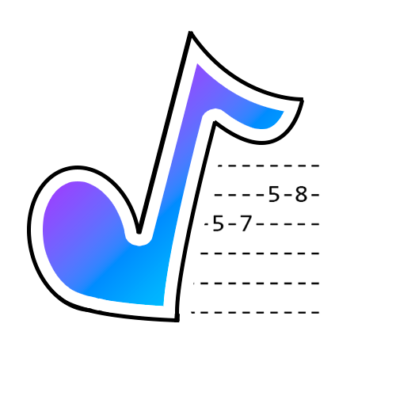

NARVÁEZ
=============

Narvaez es un sistema de traducción simple de imágenes con notación musical a tablaturas de guitarra.

# Instalar Narvaez

Para instalar Narvaez se han descargar todos los ficheros en el repositorio, y, si fuera necesario entrenar la IA, las imágenes utilizadas se pueden acceder en google Drive: https://drive.google.com/drive/u/0/folders/1OVGA3CGnEKjyg_k_L8MP2RO5R3oDIbHE

## Requirimientos para la IA integrada

Naravez requiere de la IA "Mozart", siendo su principal función cambiar la notación musical a formato capaz de ser entendido por el lenguaje.

### Contributor License Agreement
Requerimos que todos los contribuyentes reconozcan que este proyecto esta está establecido mediante una licencia Apache 2.0 y acepten todos sus términos. 

[Contribuyentes]: ./CONTRIBUTING.md

